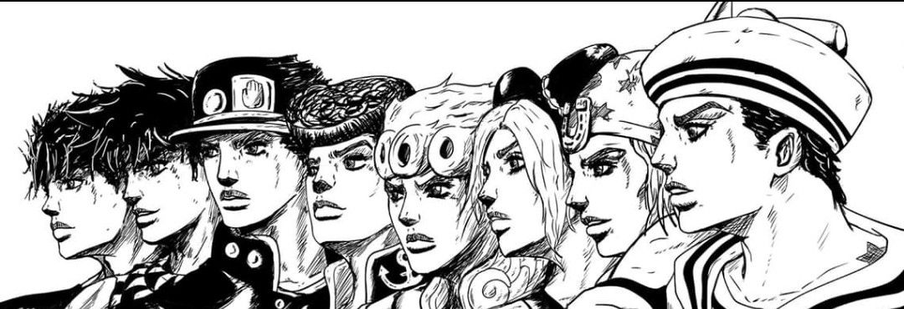
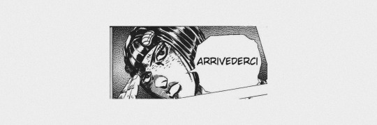

<h2 align='center'>Hello there 👋 ! Welcome to my profile😄</h3>
 

 
 

## About me:
<ul>
    <li> 🌱 - Name: Sâmia </li>
    <li>🧸- Pronouns: she/her</li>
    <li>🔥 - Hobbies: studying, drawing and listening to music</li>
    <li>💻 - Occupation: Computer Science student</li>
    <li>⌚ - Current ultimate goal: to be the best at math</li>
</ul>
 

And I also like Jojo's Bizarres Adventure and Berserk 👻

## My Socials Media Links 

## Technologies That I Use

 

 Congratulations for wasting your time reading until here 😼

